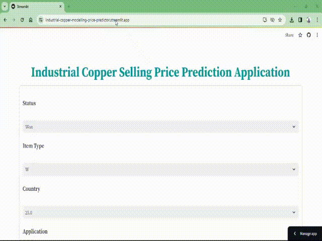

# Industrial Copper Selling Price Prediction

Machine learning model to predict selling price industrial copper based on customer, country, item type, application, thickness, width, quantity and various other parameters.

## 🛠 Skills
Python // Pandas // Numpy // Seaborn // Matplotlib // Scikit-learn // Streamlit // Machine learning 


## Run Locally

Clone the project

```bash
https://github.com/Vijaiey88/End_to_End_Industrial_Copper_Modelling
```

Go to the project directory

```bash
cd your_project_directory
```

Create virtual environment (Vscode)

```bash
conda create -p venv python==3.11.2
```
Activate virtual environment (Vscode)

```bash
conda activate venv/ 
```

Install dependencies

```bash
pip install -r requirements.txt
```

Run streamlit server locally

```bash
streamlit run app.py
```

Please make sure you have Conda and Git installed and configured on your system. Also, ensure that you have navigated to the correct project directory before running these commands.

## Demo




## Application link

Run application by clicking the below link :

https://industrial-copper-modelling-price-predictor.streamlit.app/

    
## Feedback

If you have any feedback, please reach out to me at vijaiey88@gmail.com


## Documentation

[Streamlit - Creating App and Deployement](https://docs.streamlit.io/)


